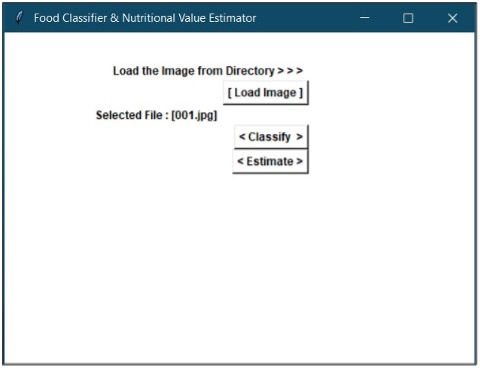
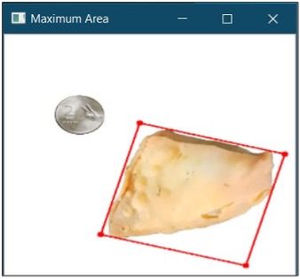
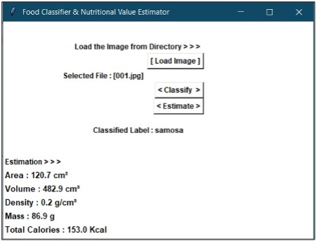

# Deep Learning based Food Classification and Nutritional value Estimation

This project provides a simple and efficient way of estimating calories from a food image. A CNN which is trained using transfer learning on Inception v3 model using Food 101 dataset with 86.6% training accuracy is used to classify the food. A smartphone-based application is employed for image acquisition. A lightweight ratio transfer algorithm is developed to estimate the size of food with reference to the calibration object and compute the total calories present in the food image.

See the model in action:

Homescreen shows the option to load the image

Estimating volume using Ratio Transfer Algorithm

Classification and Volume Report

